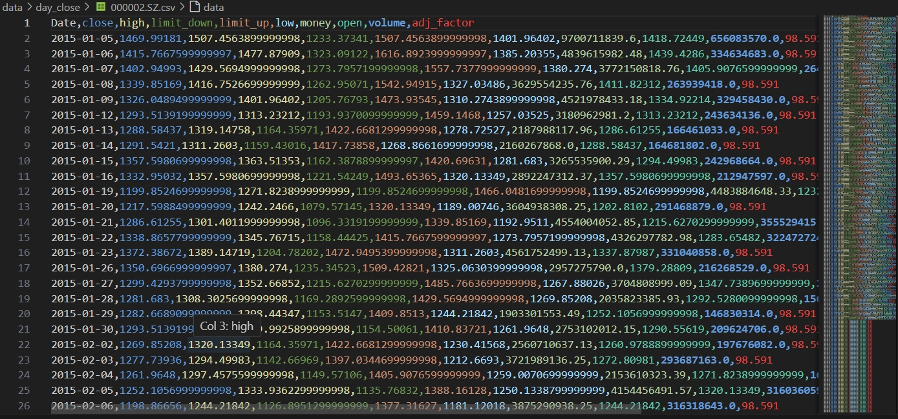
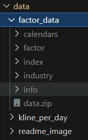

## 数据存储地址

1. 不要把数据提交到仓库
2. 在此说明文件中注明数据的格式和名称

<<<<<<< HEAD


=======
>>>>>>> 808507d19f23129adf3166c77179c000b77ad955
## kline_per_day文件夹
分票存储日k线数据


csv内部结构

<<<<<<< HEAD

## factor_data文件夹

存储了新的数据

数据读取方法
```python
import joblib
data_path = ""
df = joblib.load(data_path)
```
=======
>>>>>>> 808507d19f23129adf3166c77179c000b77ad955
